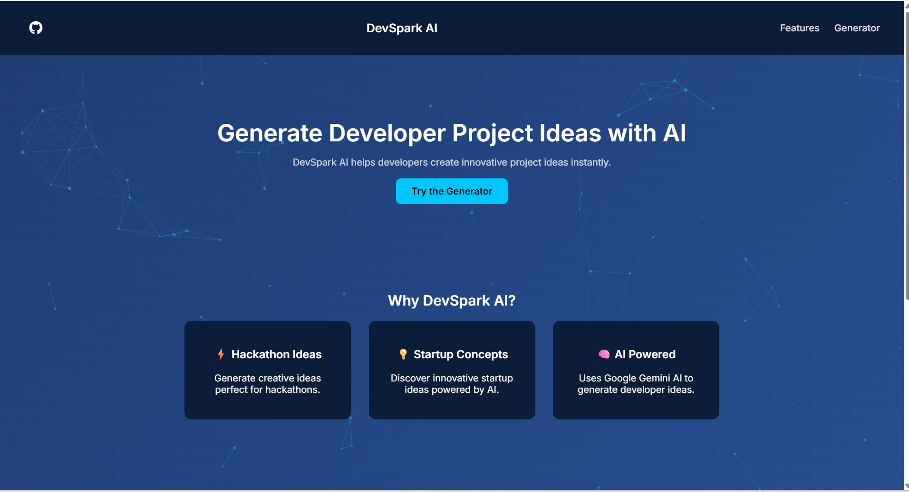
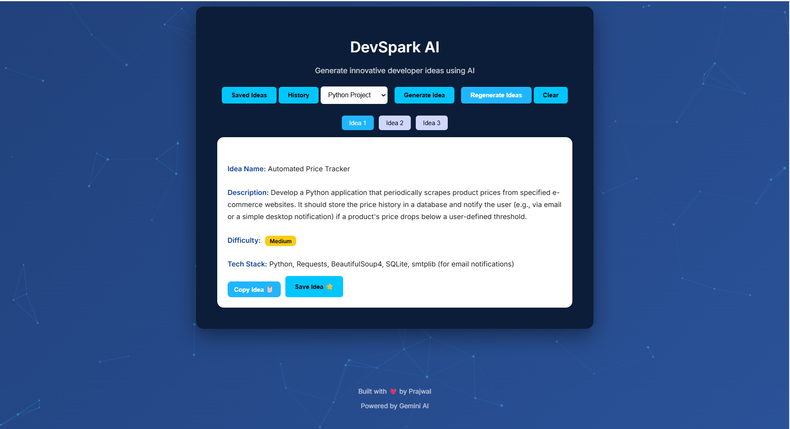

#  DevSpark AI

DevSpark AI is a web application that generates innovative developer project ideas using Google Gemini AI.  
It helps developers, students, and hackathon participants quickly discover creative project concepts.

🌐 **Live Demo:**  
https://devspark-ai.vercel.app

---

## ✨ Features

- AI-powered project idea generation using **Google Gemini AI**
- Category-based idea generation
- Multiple ideas with tab switching
- Save favorite ideas
- Delete saved ideas
- Idea history tracking
- Download ideas as **PDF**
- Difficulty badges (Easy / Medium / Hard)
- Fully responsive design
- Animated AI particle background

---

## 🛠 Tech Stack

**Frontend**
- HTML
- CSS
- JavaScript

**Backend**
- Node.js (Vercel serverless function)

**AI API**
- Google Gemini API

**Deployment**
- Vercel

---

##  Screenshots

### Landing Page


### Idea Generator


---

## ⚙️ Installation (Run Locally)

Clone the repository:

```bash
git clone https://github.com/prajwal-dotcom/devspark-ai.git
